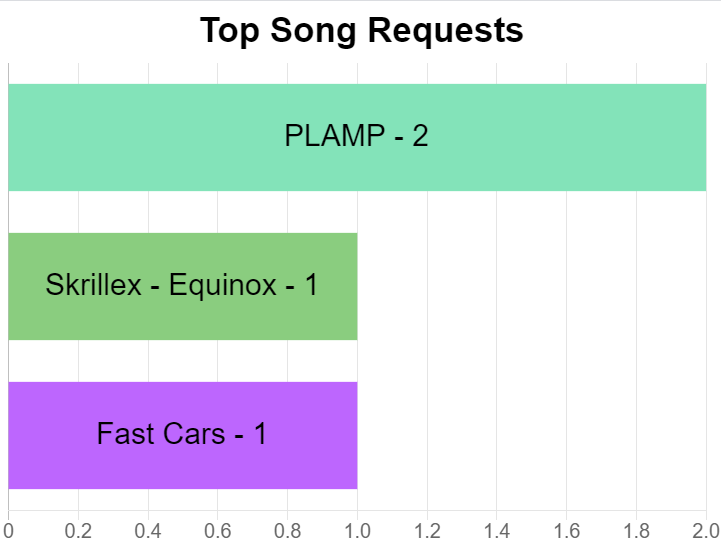

# PhantomBot SongRequest Script
This is a custom module for the PhantomBot twitch bot. Takes requsts from users and generates an overlay to show on your stream.

Overlay Screenshot:



Tested with PhantomBot 3.1.2
https://github.com/PhantomBot/PhantomBot
https://phantombot.tv/

## Installation
First you must install PhantomBot, follow instructions on their repo to get set up.

Then, clone/download this repo to a new folder on your computer, copy all contents on top of your phantombot folder. Subfolders should be `scripts/custom` and `web/obs/requests-chart`.

Then open up the overlay ui at http://localhost:25000/obs/requests-chart. Add this url as a browser source to OBS to overlay on your stream.
You have to use `!songrequests refresh` every time you open a new UI / referesh the window.

## Commands
```
# All User Commands

!request [SongName]
    Request a new song! Can request multiple songs.

!songrequests top
    Print top songs to chat.
!songrequests new
    Print most recent requests to chat.


!songrequests open
    Allow song requests

!songrequests close
    Stop allowing song requests. Does NOT delete existing requests.

!songrequests reset
    Clear all request data

!songrequests refresh
    Send data to the UI again. Needed since the data flow is strictly script -> UI without any ability for UI to request data.

!songrequests played [SongName]
    Remove an individual a song request, and mark it as played.

!songrequests delete [SongName]
    Remove an individual a song request, without marking as played. For spam/trash.
```

## Dev Notes
NOTE: I'm just developing this on top of the rgular phantomjs directory to make it easier. Therefore I have a .gitignore set up to ignore everything and then whitelist the files I created. If you create a new file, and its not showing up in git, thats why.

# Credits
Created by Michael Walker - micwalk@gmail.com